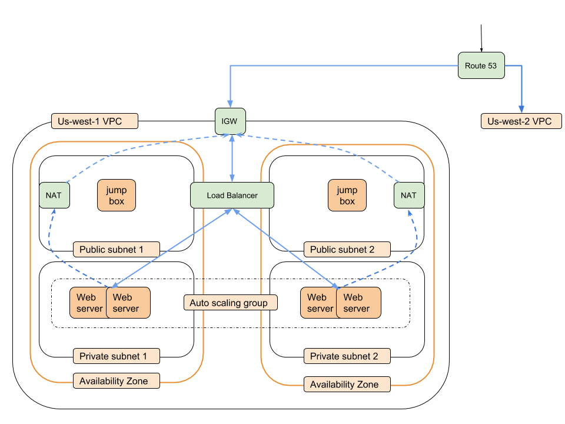

# jsonuploader_cfn
- Git link for code: [Jsonuploader](https://github.com/mshakira/jsonuploader)
- Hosted domain name: www.jsonuploader.com
- SSL enabled
 
This git repository contains the cloudformation templates for creating infrastructure for [Jsonuploader](https://github.com/mshakira/jsonuploader) web application. The infrastructure diagram is shown below.



## Prerequisites
- aws client installed ([install doc](https://docs.aws.amazon.com/cli/latest/userguide/installing.html))
- aws profile created ([doc](https://docs.aws.amazon.com/cli/latest/userguide/cli-chap-getting-started.html))
```
aws configure --profile <your_profile_name>
```

## File Structure
- The templates dir contains templates for cloudformation.
  - It includes network, web and jumpbox templates.
- The parameters dir contains parameters required for spawning infrastructure in each region.
- The Makefile contains the commands to spawn infrastructure for each region. 

## Deployment Instructions
- Entire infrastructure is divided into 3 templates.
### Network Template
- Network template [network.json](https://github.com/mshakira/jsonuploader_cfn/blob/master/templates/network.json) creates the following.
  - 1 VPC
  - 2 public subnets in 2 availability zones
  - 2 private subnets in 2 availability zones
  - 2 NAT gateways for private subnets each
  - Internet gateway for VPC
  - Public and private route tables 
- The parameters can be provided in parameters/network-{region}.json
- Launch command
```
make network-us-west-1 "PROFILE=<your_profile_name>"
```
### Web Template
- Web template creates webservers to serve jsonuploader. It creates the following.
  - auto scaling group of web servers for 2 subnets in 2 availability zones.
  - Application load balancer
  - IAM profile and IAM role
  - Application security group
  - Load balancer security group
  - Load balancer listener
  - Target group  
- Launch command
```
make web-us-west-1 "PROFILE=<your_profile_name>"
```
### Jumpbox Template
- Jumpbox template creates jump boxes in each availability zone for debugging purposes. It creates the following.
  - Instances in each public subnet
  - Instance security group
- Launch command
```
make jumpbox-us-west-1 "PROFILE=<your_profile_name>"
```
